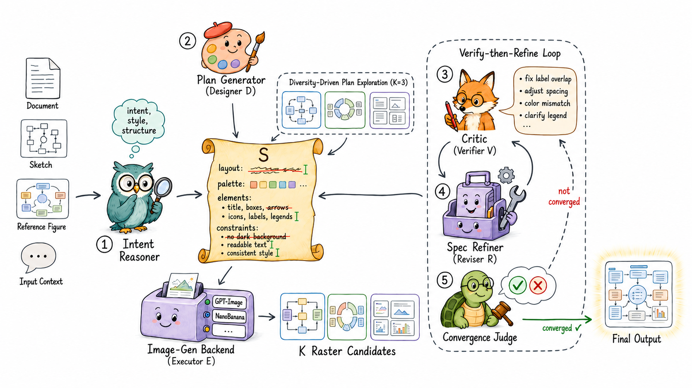
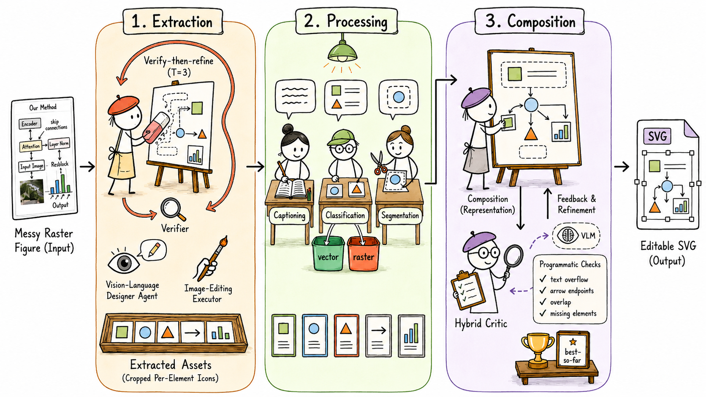
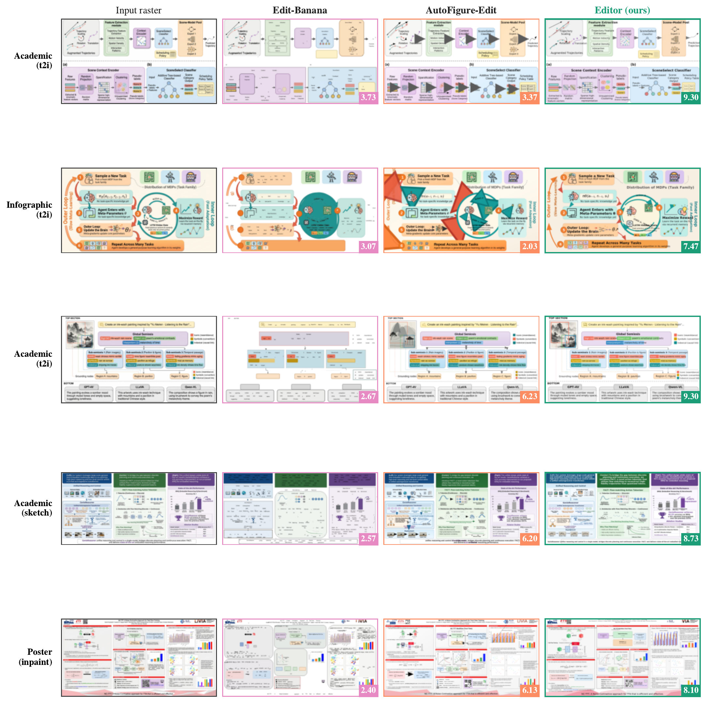
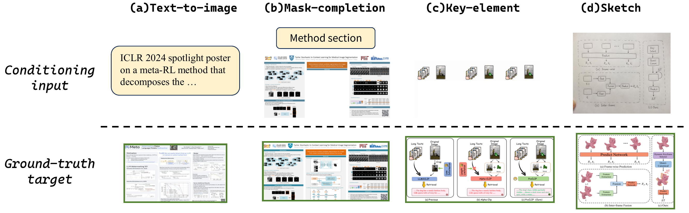
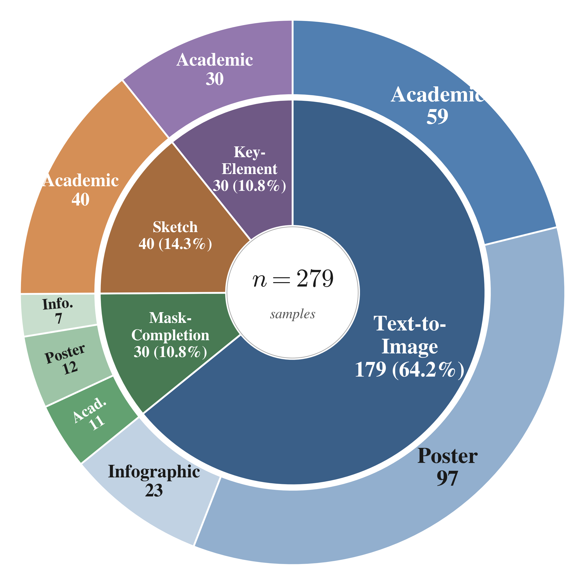

<div align="center">

# Crafter

**A Multi-Agent Harness for Editable Scientific Figure Generation from Diverse Inputs**

[](#)
[](https://huggingface.co/datasets/BleachNick/CraftBench)

Haozhe Zhao, Shuzheng Si, Zhenhailong Wang, Zheng Wang, Liang Chen,
Xiaotong Li, Zhixiang Liang, Maosong Sun, Minjia Zhang

</div>

---

Scientific figures are structured compositions of discrete semantic components,
so the localized errors image generators make on such layouts call not for a
stronger backbone but for a *harness* around it. We instantiate this idea in
two complementary systems that share one design:

- **Crafter** — a multi-agent harness for figure **generation** that
  generalizes across figure types (academic figures, posters, infographics)
  and input conditions (text-to-image, mask completion, key-element
  composition, sketch refinement) without architectural changes.
- **CraftEditor** — applies the same harness pattern to convert raster
  outputs into **coordinate-faithful editable SVGs**.

<p align="center">
  
  <br><sub><b>Figure 1.</b> The Crafter generation harness.</sub>
</p>

<p align="center">
  
  <br><sub><b>Figure 2.</b> The CraftEditor raster-to-SVG pipeline.</sub>
</p>

We also release **CraftBench** — 279 samples spanning three figure types and
four input conditions, each with a human-drawn target.

## 🛠️ Setup

```bash
git clone https://github.com/HaozheZhao/Crafter.git
cd Crafter
pip install -e .
export OPENROUTER_API_KEY="sk-or-..."
```

All chat / VLM / image calls go through a single OpenAI-compatible endpoint
(OpenRouter). The role mapping lives in
[`configs/default.yaml`](configs/default.yaml).

CraftEditor additionally needs a text-prompted SAM3 grounding server. Start
one on any machine with a CUDA-capable GPU:

```bash
# 1. Install the official SAM3 package
git clone https://github.com/facebookresearch/sam3 && cd sam3
pip install -e . && pip install timm ftfy iopath portalocker flask

# 2. Run a small Flask wrapper that exposes /health, /segment_text, /segment_points
python sam3_server.py --port 8765 --host 0.0.0.0

# 3. Point Crafter at the server
export SAM3_SERVER_URL="http://<host>:8765"
```

CraftEditor requires the SAM3 server. If you do not run one, use only the
generation half (the commands below).

## 🚀 Quick start

The bundled [`examples/`](examples/) folder has inputs for three end-to-end
runs. Cases #1 and #3 share a SceneSelect figure (CraftEditor's top-scoring
case in Figure 3); case #2 is the NC-TTT poster inpaint case from Figure 3.

All three commands use the same task templates the CraftBench evaluation
script feeds the model, so end-to-end behaviour matches benchmark runs:

```bash
# 1. Text-to-image — generate the method figure from text only.
python demo.py --paper examples/sample_paper.txt \
               --instruction-file examples/sample_instruction_t2i.txt \
               --out examples_out/figure.png

# 2. Mask completion (inpaint) — fill the blanked-out 'Methodology' column of the poster.
python demo.py --paper examples/sample_inpaint_paper.txt \
               --instruction-file examples/sample_instruction_inpaint.txt \
               --reference examples/sample_inpaint_input.png \
               --out examples_out/figure_inpainted.png

# 3. Convert a raster figure into an editable SVG.
python convert.py --img examples/sample_figure.png --out-dir examples_out/editable/
```

## ✏️ Generation

```bash
crafter generate --caption "Figure 1: Overall workflow of our method." \
                 --paper-text-file paper.txt --out figure.png
```

Add `--reference sketch.png` to condition on a sketch, partial figure, or icon
collage.

<details>
<summary><b>Use a paper PDF instead of a plain-text extract <i>(beta)</i>.</b></summary>

`demo.py` also accepts a PDF as the `--paper` argument; text is extracted via
``pypdf``. LaTeX-rendered PDFs work cleanly; scanned PDFs and dense two-column
layouts may need manual text extraction first. We recommend the plain-text path
above for reproducible runs.

```bash
python demo.py --paper paper.pdf --instruction "..." --out figure.png
```

</details>

## 🎨 Editable conversion (CraftEditor)

Default pipeline: <b>extraction (gpt-image-2)</b> → <b>grounding (SAM3)</b> →
<b>composition</b>.

```bash
# the bundled figure CraftEditor scores highest on in Figure 3.
python convert.py --img examples/sample_figure.png --out-dir examples_out/editable/
```

<p align="center">
  
  <br><sub><b>Figure 3.</b> CraftEditor (rightmost column) versus Edit-Banana and AutoFigure-Edit on five representative cases. <code>examples/sample_figure.png</code> is the input raster of the top row (academic / t2i, the highest-scoring case).</sub>
</p>

<details>
<summary><b>Skip the gpt-image-2 extraction phase (SAM-only).</b></summary>

`--sam-only` passes the raster straight to SAM3 grounding, bypassing
gpt-image-2 icon extraction. Trades quality for speed and skips one external
provider dependency.

```bash
python convert.py --img figure.png --out-dir editable/ --sam-only
```

</details>

## 📊 CraftBench

**CraftBench** — 279 samples spanning three figure types and four input
conditions, each with a human-drawn target. The dataset lives on the
[HuggingFace Hub](https://huggingface.co/datasets/BleachNick/CraftBench)
and is downloaded automatically by both `inference.py` and `run_eval`. The
[`craftbench/`](craftbench/) folder in this repo bundles three illustrative
samples (one per task) plus the evaluation scripts.

<p align="center">
  
  <br><sub><b>Figure 4.</b> Sample tasks from CraftBench.</sub>
</p>

<p align="center">
  
  <br><sub><b>Figure 5.</b> CraftBench distribution by figure type and input condition.</sub>
</p>

### Run inference + evaluation

```bash
# 1. Generate Crafter outputs over the bench (writes <id>.png per sample).
python inference.py --bench craftbench --out runs/crafter_cb

# 2. Score against the human-drawn targets (referenced VLM judge via OpenRouter).
python -m craftbench.evaluation.run_eval --runs runs/crafter_cb --out cb.json
```

`run_eval` reports an overall win-rate and a per-task breakdown.

## ⚙️ Configuration

Three model slots in [`configs/default.yaml`](configs/default.yaml):

| Slot | Default |
| :--- | :--- |
| `llm` | `anthropic/claude-opus-4.6` |
| `vlm` | `google/gemini-3.1-pro-preview` |
| `generator` | `google/gemini-3-pro-image-preview` (Nano Banana Pro) |

`OPENROUTER_API_KEY` is the only required secret; the YAML never holds keys.

<details>
<summary><b>Use <code>gpt-image-2</code> instead of Nano Banana Pro.</b></summary>

`gpt-image-2` produces sharper text and supports arbitrary pixel resolutions,
but on OpenRouter it is rate-limited and clamped to a small enum
(`aspect_ratio` ∈ `{1:1, 2:3, 3:2, 3:4, 4:3, 4:5, 5:4, 9:16, 16:9, 21:9}`,
`image_size` ∈ `{1K, 2K}`).

We recommend deploying `gpt-image-2` on your own **Azure OpenAI** resource and
exporting the four standard variables — when all four are set, gpt-image-2
calls bypass OpenRouter and go straight to Azure (everything else keeps
using OpenRouter):

```bash
export AZURE_OPENAI_ENDPOINT="https://<your-resource>.openai.azure.com"
export AZURE_OPENAI_API_KEY="<your-key>"
export AZURE_OPENAI_DEPLOYMENT="<your-deployment-name>"
# optional: override the api version (default: 2025-04-01-preview)
# export AZURE_OPENAI_API_VERSION="2025-04-01-preview"
# optional: force an exact pixel size (overrides the aspect map)
# export CRAFTER_AZURE_IMAGE_SIZE="1024x512"
```

Then point the `generator` slot at `gpt-image-2` in
`configs/default.yaml`:

```yaml
generator: openai/gpt-5.4-image-2
```

If you do not have Azure, you can still use OpenRouter for `gpt-image-2` by
swapping the `generator` slot to `openai/gpt-5.4-image-2` — outputs will be
clamped to the enum above and may rate-limit under load.

</details>

## 📁 Repo layout

```
Crafter/
├── crafter/{generation, editor, shared}/    # the package
├── craftbench/                              # 279-sample bench + self-contained eval
├── configs/default.yaml                     # 3-slot model config
├── demo.py · convert.py · inference.py      # entry-point scripts
├── examples/                                # sample paper PDF + sketch ref
├── assets/                                  # paper figures
└── README · pyproject · requirements · LICENSE
```

## 📑 Citation

```bibtex
@inproceedings{zhao2026crafter,
  title     = {Crafter: A Multi-Agent Harness for Editable Scientific Figure Generation from Diverse Inputs},
  author    = {Zhao, Haozhe and Si, Shuzheng and Wang, Zhenhailong and Wang, Zheng
               and Chen, Liang and Li, Xiaotong and Liang, Zhixiang and Sun, Maosong
               and Zhang, Minjia},
  booktitle = {NeurIPS},
  year      = {2026},
}
```

## 📄 License

MIT — see [LICENSE](LICENSE).
